# Collision and Physics
***
Before we got the Ball moving, but it runs off the edge of the screen.

>[!WARNING]
> Even if an object is out of screen view, that doesn't mean it's gone.
> If we use our ball as an example, as it travels our of view, it continues to travel for infinity in that direction.
> The issue is that the engine keeps track of the ball and is still checking against any components and scripts on it
> the entire time. 
> 
> We'll talk about this more in detail later.

## The Classic Solution
***
If we were writing this completely from scratch, which I mean not using a game engine and just solely in code, 
we would keep track of the ball manually. Since we would know the pixel size of our sprite, we would keep track of its
center point position and constantly check if it's at the edge of the screen. Once it reaches the edge, we would have 
code to send it in the opposite direction.

## A Unity Engine Solution
***
Instead of following the classic method, let's take advantage of Unity and its built-in capabilities, so
let's add some boundaries to the top and bottom of our screen.

We can do this in Scene view by adding a square 2D sprite in the same way that we created our ball.

* Right-click or click on the plus button ( + ) in the Hierarchy. 
* Then from the context menu, **2D Object > Sprites > Square**.

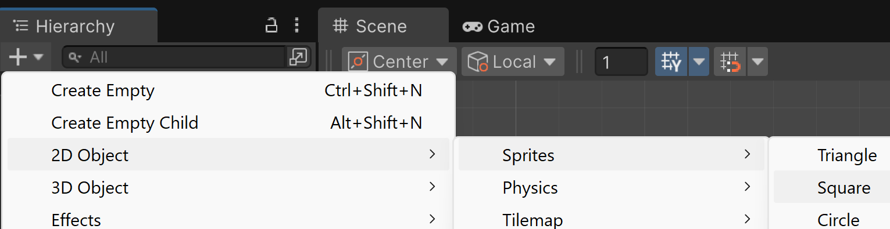

* Then I'm going to rename the sprite from _Square_ to _TopB_, for top boundary. 
* Now, using my mouse, I'm going to move TopB to the top-left of my screen outline
* Then click on the blue dots on the right-hand side of TopB and drag right until it's as long as my screen outline.

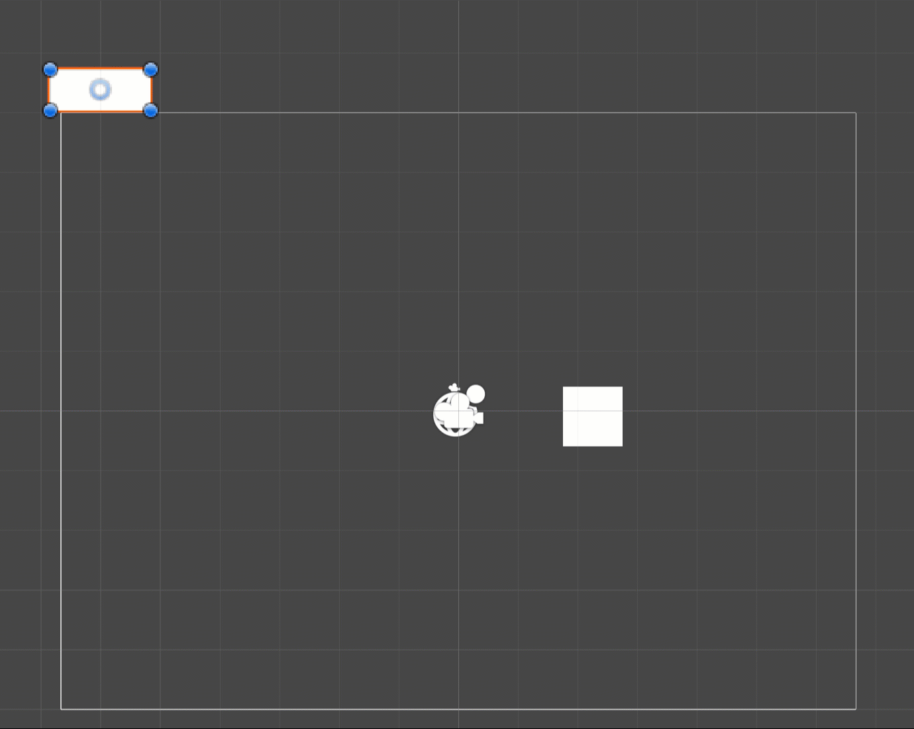

Then I'm going to use the center point on TopB to move it into place. I want TopB to sit right on the edge of the screen,
while not being in view when playing the game. We can check this in the Game tab.

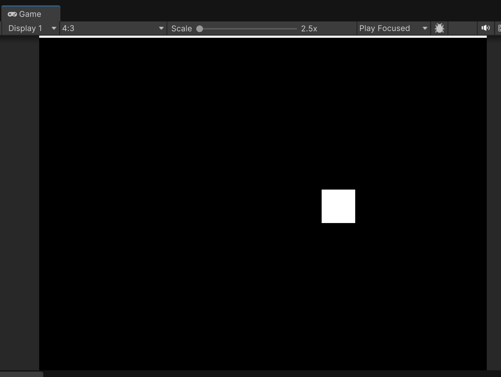

Since I can still see it, I know it needs to go up a bit more. Rather than guessing with the mouse, let's be more precise 
by using TopB's transform properties in the Inspector panel.

### Transform
***
Transform shows you the exact position, rotation, and scale relative to axis X, Y, and Z from the center-point of the
selected object. You can manually type the values in so that you're not just guessing.

The coordinates needed for your TopB's position depends on how much you changed the scale of your TopB. Below are the 
transform properties that worked for me. If you want, you could simply enter the same values, but make sure you understand
the relation between the transform properties.

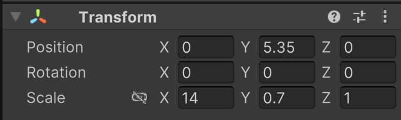

### Test
***
Select the Ball in the Hierarchy, and then press the play button. This will allow to see the Ball's transform properties
while the game is running.

We can notice two things. One, our boundary doesn't stop our ball, and if we watch the Y Position value of the Ball, it goes on forever.

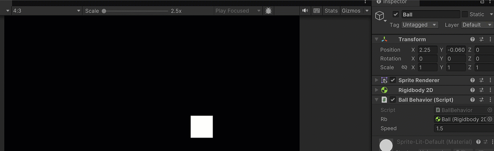

### Collision
***
In order for Unity to handle the physics for us, we need to tell the engine that our Ball and boundary can collide with one another.

We can do that by adding a _Box Collider 2D_ component on both the ball and boundary.

>[!NOTE]
> Remember you do this by selecting the object in the Hierarchy, clicking on the Add Component button at the bottom, and then
> search for "box", and add the Box Collider 2D component.

After you add the colliders, you should see this:

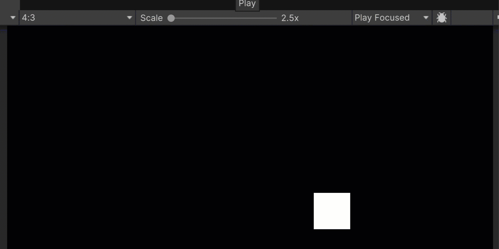

Currently, our Ball has zero bounce. It just hits the wall and stops. We could write some code so that the ball knows
when it hits a boundary, and then we could have it act accordingly. Since we're just starting, let's instead look
into how Unity can handle this for us.

### Physics Material 2D
***
Fist I want to make sure I'm keeping my Assets folder organized, so I'm going to create a new folder named _Ball_. 

>[!NOTE]
> As your objects grow more and more complicated, you want to make sure you can easily find each item relating to that object. 
> The easiest way to do this is to create folders as needed.

Inside my Ball folder, I'm going to create a new Physics Material 2D by right-clicking > Create > 2D > Physics Material 2D

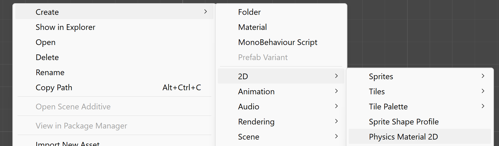

>[!WARNING]
> In the context menu of Right-Click > Create, you'll notice there's an option to create a _Physics Material_. This is NOT what we want.
> Since Unity handles creating both 2D and 3D games, you need to make sure to choose the appropriate version. If later on you don't see
> the physics material you created, it's most likely because you created a _Physics Material_ for 3D and not a _Physics Material 2D_.

Rename the Physics Material 2D to Bounce. With it selected, you should see some available properties we can change in the Inspector panel.

>[!IMPORTANT]
>If you changed the name using the rename option, you'll see a warning like this:
>
>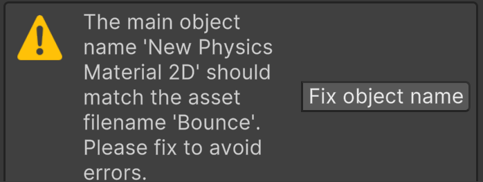
>
>Just click on the "Fix Object Name" button to resolve the issue.

Set it so that Friction is 0 and Bounciness is 1.

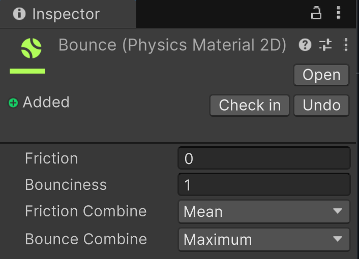

### Make The Ball Bounce
***
Select the Ball.  In the Inspector > Rigidbody 2D, you'll see a property named _Material_. You'll see that it currently has the
default value of missing. Click the icon to the right, the dot within a circle.

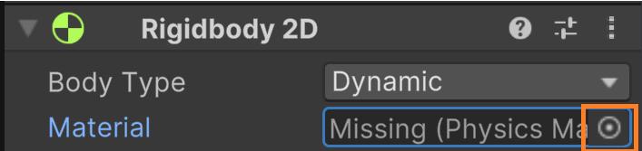

You'll be given a lost of all available items that are compatible with the property. You should only see two options, _None_ and the _Bounce_ material that we created earlier.

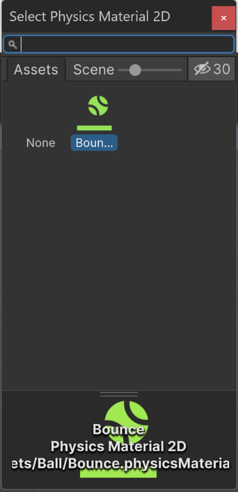

Select Bounce and run the game.

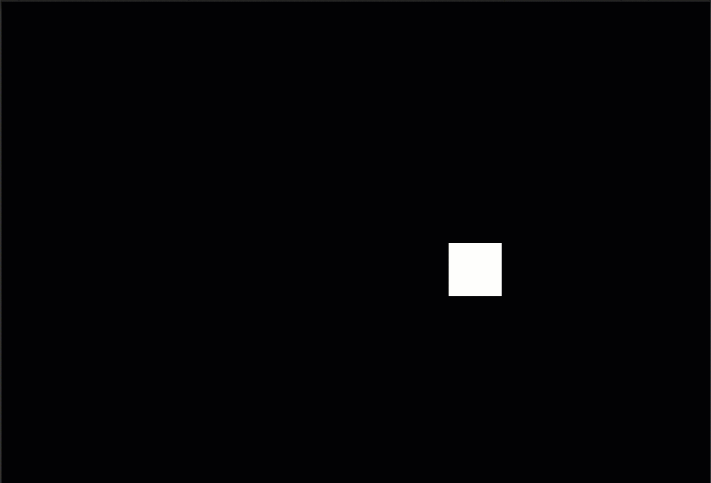

Ooooooooo. Ahhhhhhhh. So bouncy.

### Duplicate
***
Now we need to do the same thing for the bottom of the screen that we did for the top. 

In the Hierarchy, right-click on TopB and select Duplicate from the menu.

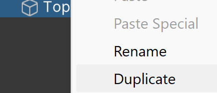

Now rename _TopB (1)_ to _BtmB_, and position it at the bottom. You can just make its Y value negative. My BtmB transform looks like this:

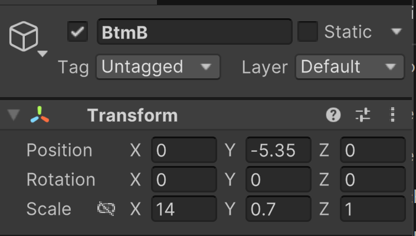

---
Next we'll look at how we can get player input.

---
>Next: [Player Input](/02_Input/INPUT.md)
