# Player Input
***
Now let's create a paddle for our first player, and make it so we can control that paddle.

## Create A Paddle
***
* Now we need to create another 2D Object > Sprites > Square.
* Name it P1
* Resize it to try and match how it should be.
* Add a _Box Collider 2D_ component.

Here's my P1 transform info:

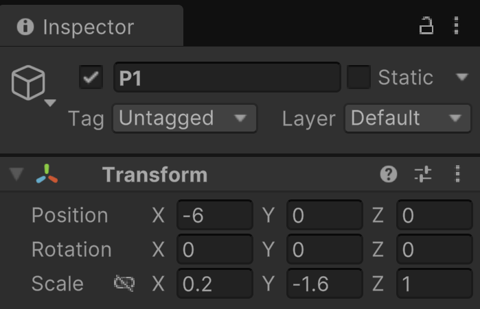

## Input
***
>[!NOTE]
> As of Unity 6, the version we're using, the Input system has changed. Unity suggests all user inputs should start being 
> handled by their new Input Management System, but I feel like it overcomplicates things when you're just starting out and
> only need simple inputs. For that reason, we are going to continue using what's now called the legacy Input Manager.

* In your Scripts folder, create a new Monobehaviour Script and name it Paddle. 
* Add the Paddle script to P1 as a component.
* Double-click the Paddle script to open it.

In our script, we want to make it so that P1 is controlled by the player using the keys 'W' (for up) and 'S' (for down).
We only need to know if those keys are being pressed down or not, so like if they are true/false or 1/0. That makes it sound
like a boolean would be the best type to store this information in. We also want to make sure we catch whenever the player
presses or releases either key, so we want to put our code in the Update function, which runs once every frame.

To do that in Unity, we'll start by doing this:

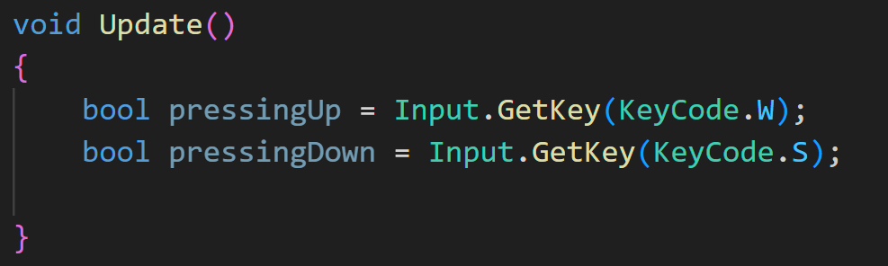

So what's going on here? We create a boolean variable to store the result of these input queries. 

The status comes from Unity's built-in Input class. 

>[!TIP]
> [If you're curious you can find reference to the Input class here.](https://docs.unity3d.com/6000.0/Documentation/ScriptReference/Input.html)

Within that class is a function named GetKey. From the API we can see that:

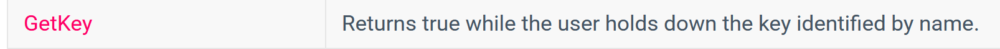

So GetKey will return true or false depending on the status of the requested key.

## Making Decisions (If Statements)
***
When we need to make a decision in code of what to do based on a true or false condition, it's common to use an if-statement.
The basic syntax looks like:

> if ( condition to evaluate )
> {
>   _do something if condition is met_;
> }

The condition itself can be written in many different ways, but it ultimately comes down to if the result of the condition is true or false.

To check if the 'W' key is being pressed (returning true), we could write it like:

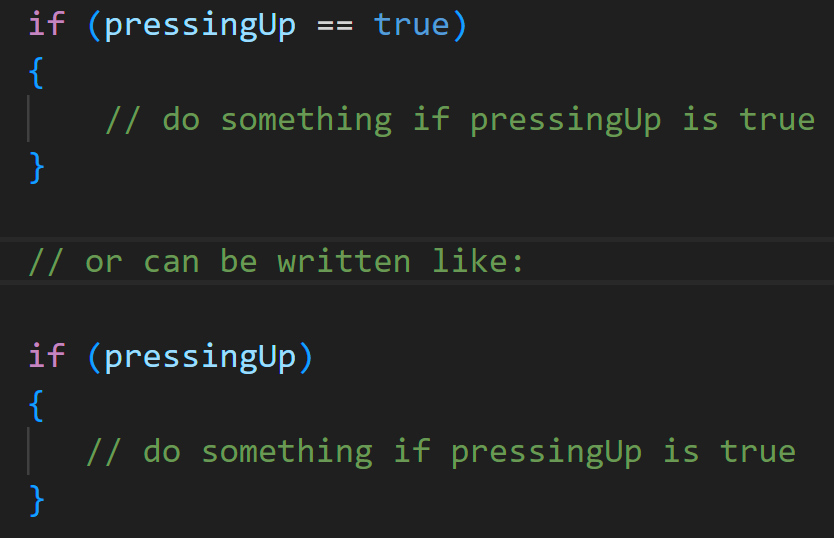

>[!NOTE]
> There is a difference between '=' and '==':
> 
> '=' is used when we want to set a variable _EQUAL TO_ some value.
> 
>       ex. A = B means we are saying that A now equals the value of B. 
> 
> '==' is used for evaluating conditions.
> 
>       ex. A == B means we're asking if the value of A _IS EQUAL TO_ the value of B.

We can test it out by writing to the console.

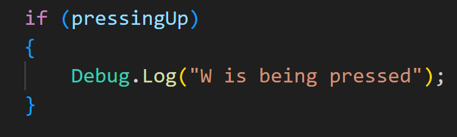

Save the script and run the game:

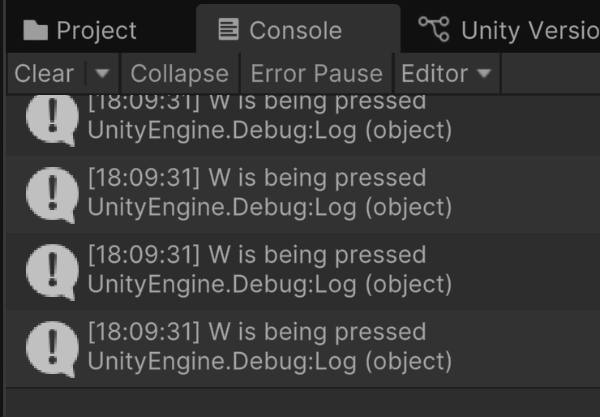

## Moving
***
We know that our key input is working, but how do we move the paddle? 
We can use the object's transform component. Within the transform component is a function called Translate.

>[!NOTE]
> Unity's API describes the Translate function as: "Moves the transform in the direction and distance of translation.",
> and that the function takes a Vector2 or Vector3 as input.

As mentioned previously, Vector2 is a class created by Unity. It also has some helpful properties to make things easier.
To use Vector2 to specify that we want to move in the 2D up direction:

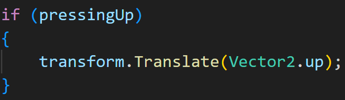

Now if you save the script and run the game, you'll see you can move the paddle up.

## Speed and Time
***
If you ran the program, you probably noticed a couple of things. 

1. The boundary didn't stop the paddle. 
2. The paddle moved so quick you may have even missed it.

Let's deal with the second one first.

Remember that everything we do in Update() runs every frame, so like 30-60 times in one second. So even if you were to hold
down the 'W' key for one second, it's essentially like you pressed it 60 times.

To help get around this we can use the value of _Time.deltaTime_. 
This is described as, "The interval in seconds from the last frame to the current one (Read Only)." This gives us a constant
time of one second to work against. 

We use it by multiplying our Translate input value (Vector2.up) by Time.deltaTime:

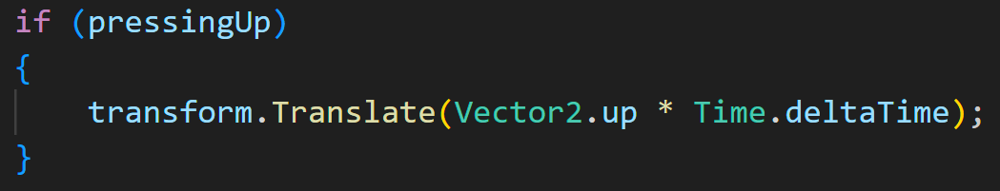

If you save the script and run the game, you'll see that the paddle moves in a nice constant motion.

But what if you want to increase or decrease the speed of the paddle? We can do this similarly to how we can change 
the speed of the ball, by adding in a variable for speed. To finish this script up for now, we need to:

1. Create a global public float named paddleSpeed and set its default value to 1.5
2. Multiply the current Translate input by paddleSpeed.
3. Create an if statement to check if the down key is being pressed.

My script end up like this:

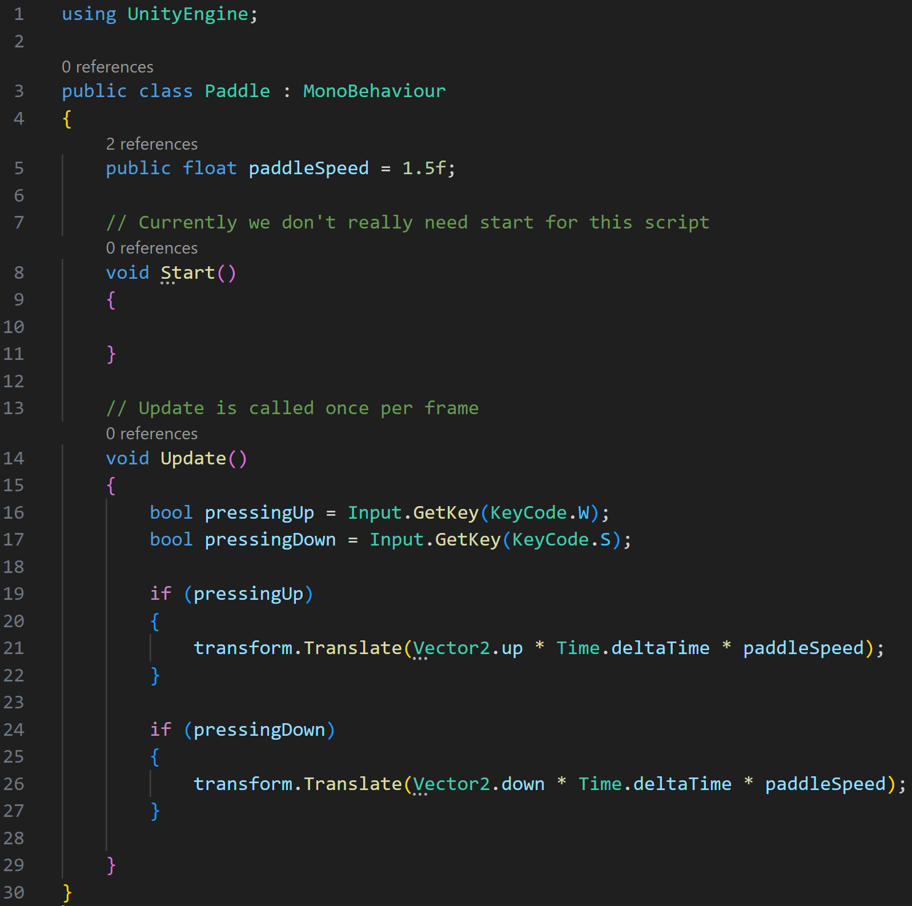

## Fixing The Paddle
***
To fix the issue of the paddle not colliding with our boundary, we just need to add a _Rigidbody 2D_ component to it.

>[!IMPORTANT]
> Remember that we want Unity to handle detecting collisions for us, but we don't want Unity to apply gravity to our paddle, since
> we're in a top-down view. So you need to change the value of _Gravity Scale_ within the _Rigidbody 2D_ component to 0.

Now you can test out the collision.

## WTF?
***
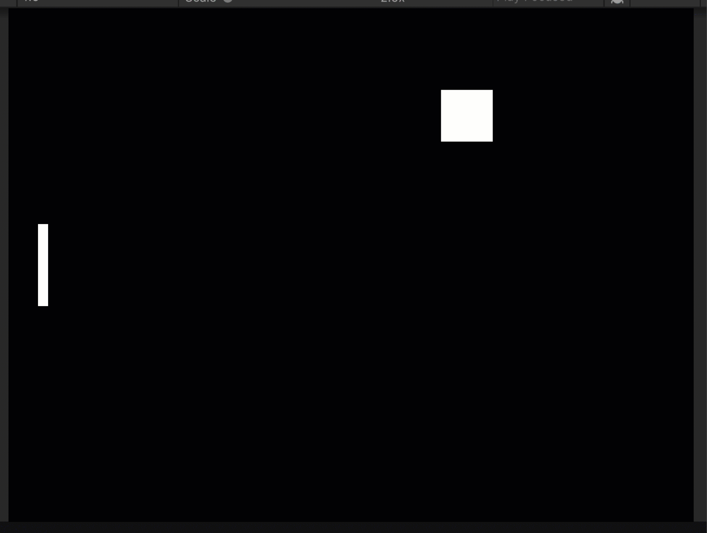

You may notice that if you continue to hold up or down once the paddle collides, the paddle starts rotating. This is because this is what Unity thinks we want to happen when it's
trying to figure out the physics of what's going on. Luckily there's an easy fix for this.

If you play the game, and select P1 in the hierarchy, we can see a live view of P1's properties in the Inspector panel.

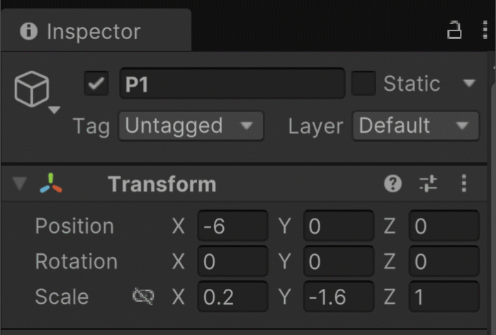

If you watch P1's Transform component, you can see that after it collides, it starts rotating on the Z axis. We can fix this by expanding the 
_Rigidbody 2D_ component attached to P1. Inside you'll see a property named _Constraints_. After expanding that, you'll see that one of the options available is to freeze
all rotation along the Z axis. This will prevent our paddle from rotating.

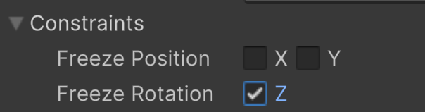

---
>Prev: [Collision and Physics](/01_Collide/COLLIDE.md) |  Next: [Launching The Ball](/03_Launch/LAUNCH.md)