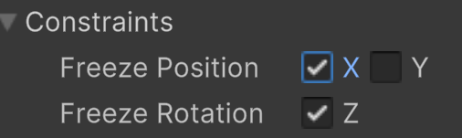

# Launching The Ball
So far we've just had the ball moving in one direction. Now we'll revisit our BallBehavior script to add some
additional functionality.

## Ball Size
Before we go to the script, let's change our Ball's scale to be more appropriate.
You can adjust it how you like. For me, I found that I liked a scale of 0.25 for X and Y.

## Ball Starting Position
When looking at our example game of Pong, you can notice that the ball always launches from middle of the screen towards
the player. As we used the Transform component before, we can do the same here to tell Unity where we want the Ball to start.

So now my Start() function looks like this:

>[!NOTE]
> Notice the use of the "new" keyword. When we're creating an instance of a class, we have to specify that we're 
> creating a _new_ one by using the "new" keyword. Then we can provide our desired X,Y coordinates as a float.

Now when you run the game, you'll notice that no matter where you place the ball in the scene, it always starts at (0,0).

## Get Random
Okay so we have the ball starting at the center of the screen, but from our example game, we can see that isn't always the case.
It seems to always start at 0 X, but Y can be anywhere.

>[!NOTE]
> This is a small but important example of a game mechanic. If the ball always launched from the center, it would start becoming
> more predictable. In a game like this where there's little going on, being predictable leads to boredom very quickly. By just
> randomizing such a small aspect, we can make things more exciting and unpredictable.

We can generate a random float value within a given range by using Unity's [_Random.Range_](https://docs.unity3d.com/6000.0/Documentation/ScriptReference/Random.Range.html) function.
That could look something like this:

We create a float variable that stores the randomly generated number in the range of -4.7 and 4.7, which are both included in the possible output. Then 
we use that variable in place of the Y coordinate when setting the position.

Where did -4.7 and 4.7 come from? Save the script and head back to Unity.

To get my possible min/max values, I moved my ball to the highest point where I would want it to spawn. I then looked at the value of its Y Transform position. I also know that
the lowest position would be that same value but negative.

Now each time I play the game, I can see that the ball starts at a random position along the Y axis.

## Moving Towards The Player
Back in our script, remember that previously we made it so that we were only adding force (velocity) to our ball along a single axis (Y). Now let's make it so we
apply force to both the X and Y axis, so instead of using _rb.linearVelocityY_ we'll use _rb.linearVelocity_ like this:

We make the X value of the new Vector2 negative so that it will head towards the player, which is on the left (or negative) side of the screen.

We can also make this a variable so that we could launch the ball in either direction if we wanted. We'll do this by
creating a public global integer called direction, so the script will now look like this:

Save the script and play the game.

## Paddle Fixes

You'll notice that if the paddle makes contact with the ball two things happen:

1. The paddle gets pushed back
2. The ball only travels up and down

Both of these issues relate to how physics are being applied to our paddle. If we want to emulate the original Pong, we can 
go to the Paddle's Rigidbody 2D component > Constraints and freeze the position along the X axis. This will prevent it from moving
to the left and right. This also prevents the ball from transferring its momentum into the paddle. So the ball should bounce off, and this
fix should solve both issues.

---
>Prev: [Player Input](/02_Input/INPUT.md)  |  Next: [AI - Kind Of](/04_AI/AI.md)