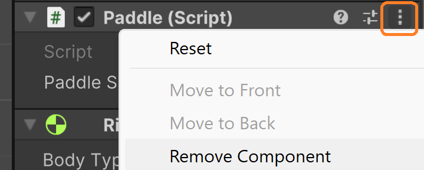
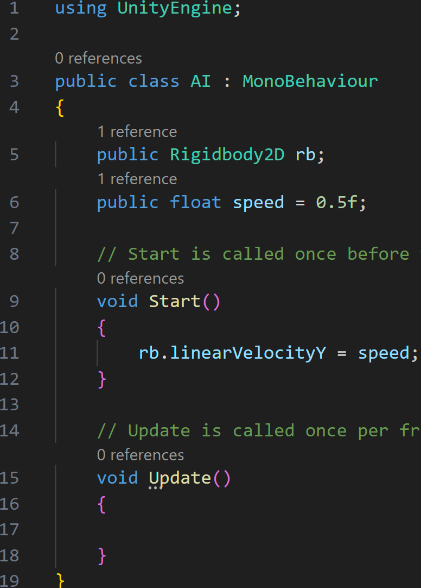
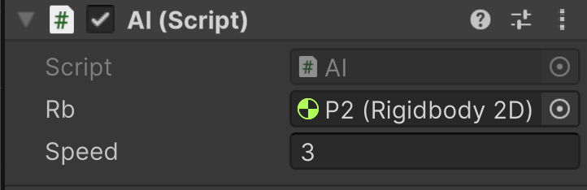

# AI - Kind Of

1. In Unity, let's duplicate P1.
2. Change its name to P2.
3. Make its X position be 6.

Now we don't want the player to control both paddles, so we need to remove the Paddle script component from P2.
You do this by clicking on the 3 dots on the right side of a component, and then select Remove Component from the list.

To make our lazy AI system, we also want to take advantage of the Bounce material that we made previously.
Add the Bounce material to the Rigidbody 2D component of P2.

1. Now create a new script and name it AI. 
2. Add the script to P2.
3. Open the AI script.

We're going to use the same logic we originally used with the ball, so the AI script looks like:

Save and head back to Unity.

In the AI script component, associate the rb variable with the component and change the speed value to something like 3:

---
>Prev: [Launching The Ball](/03_Launch/LAUNCH.md)  |  Next: [GameManager](/05_Manager/MANAGER.md)

