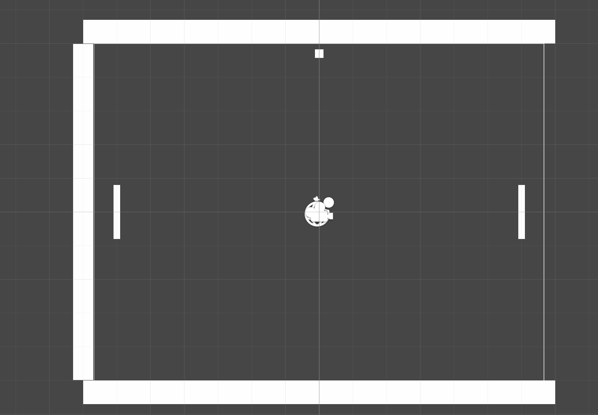
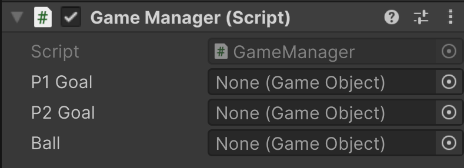

# GameManager
We've been talking about the player, the ball, and boundaries, but we haven't really implemented any rules of the game yet.
If you kind of mentally zoom out of where we are currently in the game, this is where we would have a game manager dictate
all the rules of the game and keep track of things, such as score.

## Goals - Like The Physical Ones
Before we can start tallying points, we need to set up a way to know when either the player or AI has scored.
Again we're going to take advantage of modern systems within Unity.

Duplicate TopB and rename it to P1 Goal.
Make it so that it fits vertically just to the left of the white line on the left side.

In its Box Collider 2D component, check the box for Is Trigger.

By making the collider a trigger, it will no longer collide with our ball. Instead, we can use it to know when something
has passed through the collider.

## Goal! - Like When You Score A Point
To add in this functionality, we need to add a script to our goal. Create a script named "Goal", add it to P1 Goal, and
open it.

Because we set up the collider to be a trigger, we can use a function pre-built by Unity to detect when other objects
with 2D colliders enter, like our Ball.

We can actually get rid of Start() and Update() because we don't need them. The function we're adding is a trigger function,
so it will run whenever it gets triggered. This means our script looks like this:

You'll notice there a log statement so we can test it out.

If you allow the ball to pass by the paddle, you should see this printed to the console:

We know it works, but let's add one more element to our code.

We're going to use a boolean to keep track if a point has been scored.

Now, duplicate P1 Goal and rename to P2 Goal. Then move it to the other side.

## Empty Gameobjects
When you right-click in the Hierarchy, you'll see that one of the options to choose from is Create Empty. If you do this
you'll see that the default name is GameObject.

If you select it and check out the Inspector, you can see that it's completely empty aside from having a transform component.

There are two main uses for an empty object.

### First - Organization
As your game gets increasingly complicated, it gets increasingly harder to tell what's going on in the Hierarchy. What 
if there were a way to group like objects so that you can find them easier? Well that's once use for empty objects.

I'm going to rename my empty object to Boundaries. Then I'm going to select TopB, BtmB, P1 Goal, and P2 Goal. Then I'm going 
to drag and drop those objects onto my empty Boundaries object.

### Second - Holding Scripts
The second use is simply just holding scripts. You can write all the scripts you want, but they don't have any effect unless
their placed as a component on an object. This is how we'll create our game manager, an invisible entity that dictates the rules of the game.

## GameManager

1. Create an empty object and rename it 'GameManager'
2. Create a script named GameManager and it to the object
3. Open the script

The game manager dictates and keeps track of all the rules for a game. It essentially controls the flow of the game, so
let's think about the basic steps of gameplay.

1. The first ball is sent towards the left player.
2. A point is scored once the ball passes behind a paddle.
3. The ball is sent towards the player that last scored

From this list we know that the GameManger needs to:

1. know when a player has scored
2. keep track of each player's score
3. Manage the direction of the ball after a score

### Tracking Score
To start of with, let's just create two global integers that will hold the value of each player's score.

We made it so that our goal objects know when the ball crosses, and our GameManager needs that same information.
So we can create public variables to hold reference to each goal. Remember that out goals are GameObjects, so we can 
create the variables like this:

Finally, we want reference to the Ball so that we can change the direction as needed, as well as some other things we'll discuss.

Save the script and head to Unity.

### Fill in the Blanks
Now you should see the variables we created on the GameManager script component:

To get reference to our objects, we can drag and drop them from the Hierarchy into their spot on the component:

Do this for each reference.

### Accessing GameObjects
When we want to get information from GameObjects, you can think of it like digging down until you get what you want.
Right now we want to make sure our GameManager knows when a point is scored, so we want to access the scored boolean that 
we made in the Goal script.

>[!TIP]
> The flow is: GameObject > Component > Component Properties
> 
> So for P1 Goal, it would be: P1 Goal (GameObject) > Goal (Script Component) > scored (boolean)

So if we wanted to check if a point has been scored against P1, we could do this in the Update function:

Save the script and run the game.
If everything works, we should be able to see the message printed out when the ball passes behind the left paddle.

Now we know a couple of things.

1. It works.
2. The variable is true forever.

### Adding Score
Now we can set up some logic to start keeping track of player points.
We want to create another if statement for P2Goal and add one to the correct variable:

>[!TIP]
> When adding 1 to a variable, you have three ways you could do it
> 1. variable = variable + 1;
>    * the variable is set equal to its current value plus one. The number 1 could be substituted for any other number.
> 2. variable += 1; 
>    * this is shorthand for the statement above and acts the same.
> 3. variable++;
>    * This increments a variable by 1. This can only be used to add 1 to a variable.

### Reset Scored
So that we don't add infinite points to a player, we need to reset the scored boolean so that it doesn't trigger the 
if statement. We can do that like this:

### What About The Ball?
Currently when the ball passes by, a goal is triggered, the GameManager know about it, but the Ball continues off-screen for infinity.
It's really not good to have objects off-screen if we no longer need them, especially if Unity is still running physics calculations on it.
The best thing to do is to destroy the GameObject. We can do that by using Unity's built-in Destroy() function.

>[!NOTE]
> The syntax for Destroy() looks like this:
> 
> Destroy(_the name of the GameObject to destroy_);

After we destroy it, we're going to need another one. We can spawn a new instance of a GameObject by using the Instantiate() function.

>[!NOTE]
> The syntax for Instantiate() looks like this:
>
> Instantiate(_the name of the GameObject to create_);

Now we can add these to our if statements:

In order to make a new Ball, we can check to see if our Ball has been destroyed or not. You can check if a GameObject has
been destroyed or not by using the IsDestroyed() function. This will be true or false depending on if the object exists or not.

Now You can save the script and try it out.

### Error

So things aren't working exactly how we want. This is because when we destroy the Ball, it's just like we're deleting 
it from the Hierarchy. This means that our GameManager no longer has reference to the Ball GameObject. How do we get around that?

---
>Prev: [AI - Kind Of](/04_AI/AI.md)  |  Next: [Prefabs](/06_Prefabs/PREFABS.md)