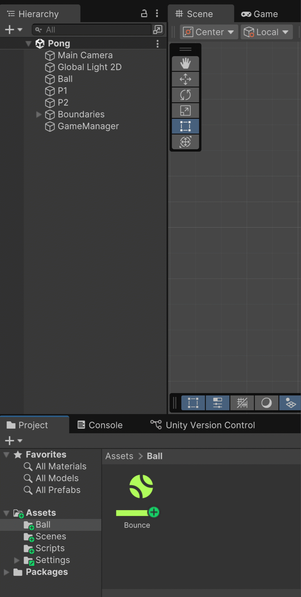
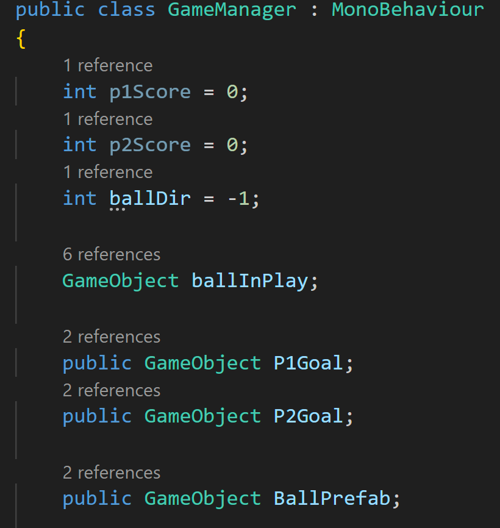
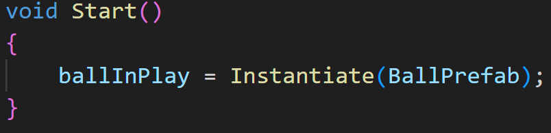
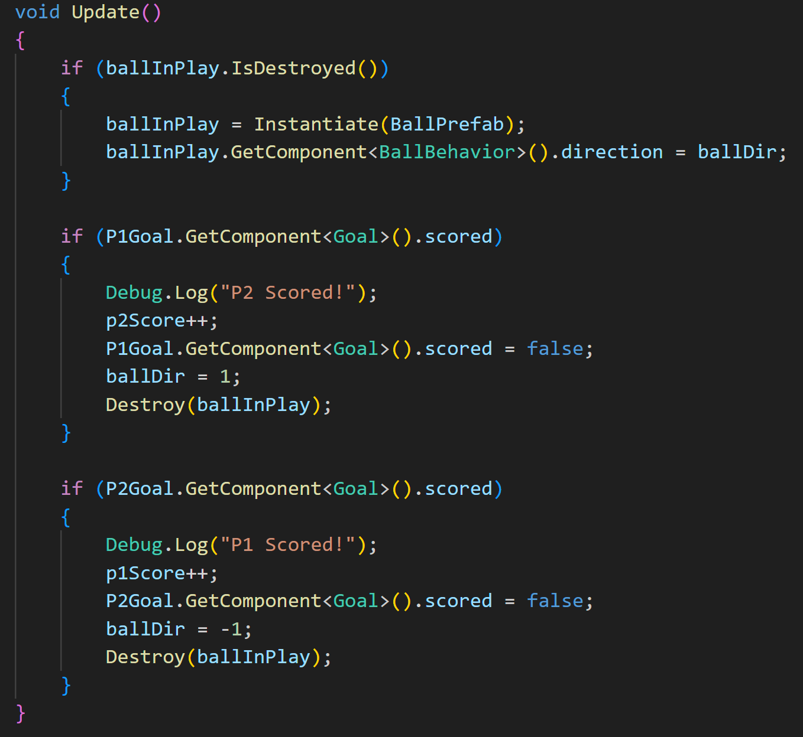

# Prefabs
***
> Unity’s Prefab system allows you to create, configure, and store a GameObject
complete with all its components, property values, and child GameObjects as a reusable Asset.
> The Prefab Asset acts as a template from which you can create new Prefab instances in the Scene.
> 
> [Unity Manual](https://docs.unity3d.com/6000.0/Documentation/Manual/Prefabs.html)

## Creating Prefabs
In order to get around the issue with our GameObject being deleted, we need to turn our Ball into a Prefab. This is really easy.
You can just drag your object from the Hierarchy and drop it into a location within your Assets folder. Let's create a 
Ball prefab in our Ball folder:

Notice that the icon become a blue box. This is the prefab icon. 

Now we want to delete _Ball_ from the hierarchy. Then you want to select the GameManager, and reassign the Ball reference to reference the
Ball prefab.

## Spawning A Ball
Now that our ball is a prefab, we need to make some changes to our GameManager script.

First we'll create a variable to be the ball in play. To make things easier, I'll add a variable to keep track of which direction the ball should
be going when spawned. I'm also going to rename our Ball reference to BallPrefab to be clear about what I'm referencing.

Since we deleted the Ball prefab from the Hierarchy, we need to make one to start the game with. We'll do that in Start():

To have the ball launch towards the player that last scored a goal, we do that by changing the
direction variable inside the BallBehavior script.
With the variable changes, Update() now looks lke this:

---
>Prev: [GameManager](/05_Manager/MANAGER.md) |  Next: [User Interface](/07_UI/UI.md)