# User Interface

Right-click > UI > Legacy > Text

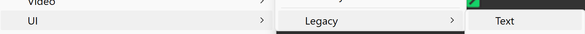

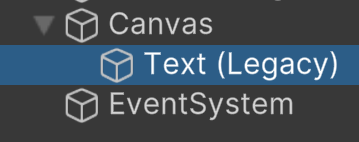

You can delete EventSystem

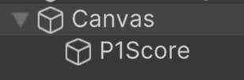

Scroll / zoom out

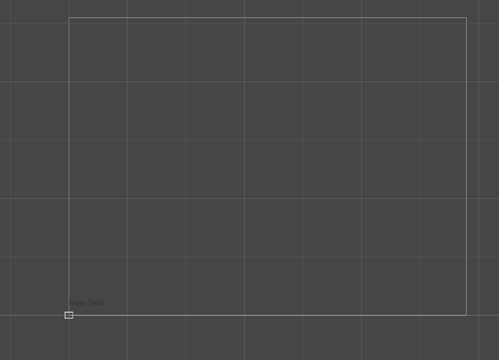

On text change:
* Height to 80
* Text to 0
* Font Size to 70
* Alignment to Center
* Color to white
* Place it

I wound up with:

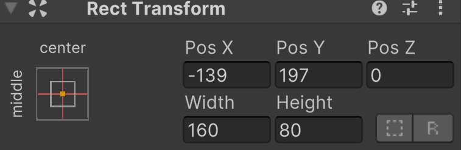

Duplicate it and rename to P2Score
Move it.

Code it

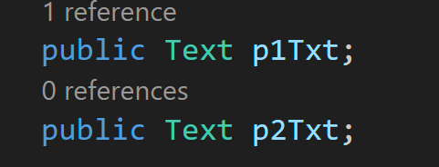

update text

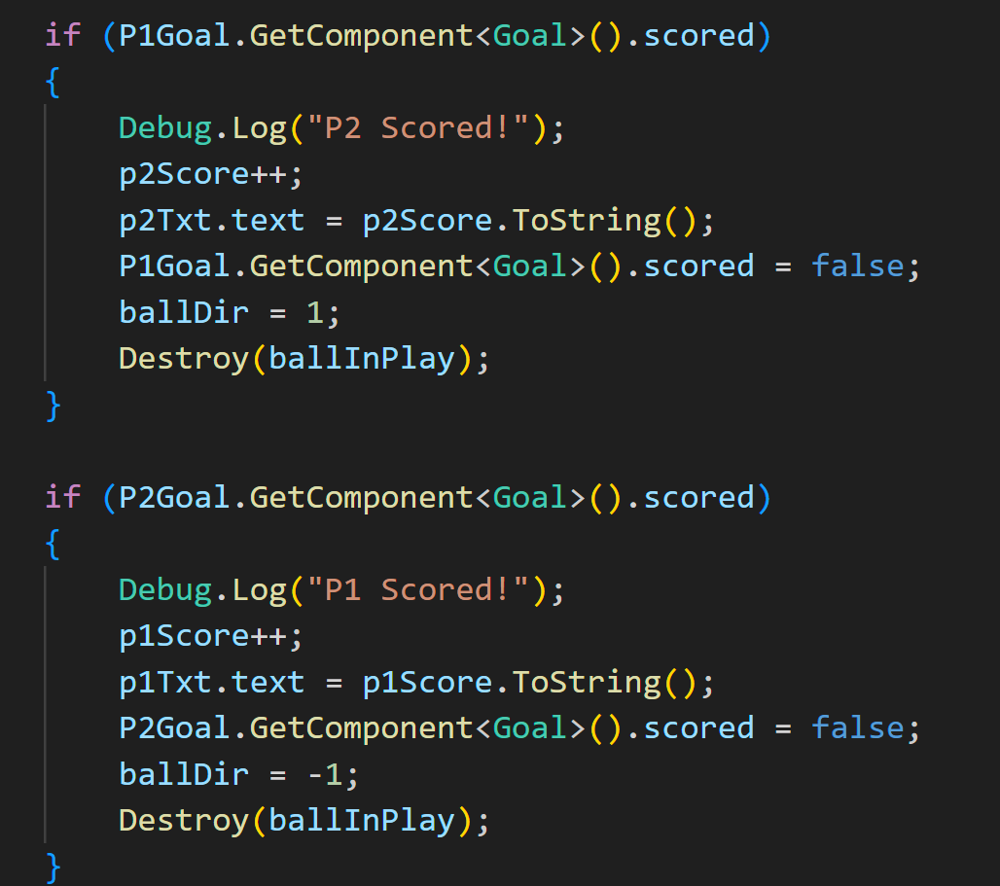

Save, go to unity

Assign UI elements to GameManager

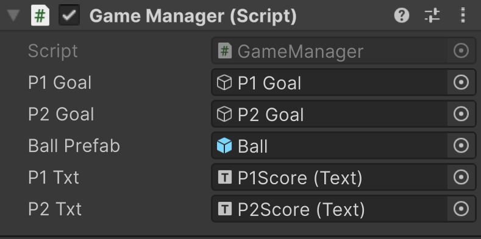

Create a net by making another text element named Net

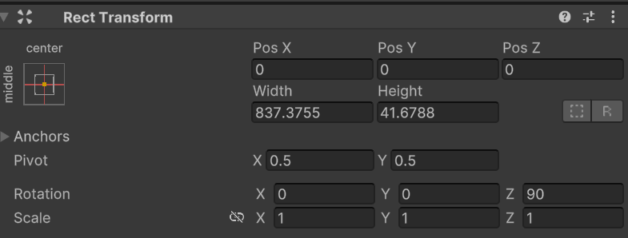

Rotate Z 90
Text - - - - - - - - - - - - - - - - - -
Font Size 80
Alignment: center both
Vertical overflow: overflow
color white

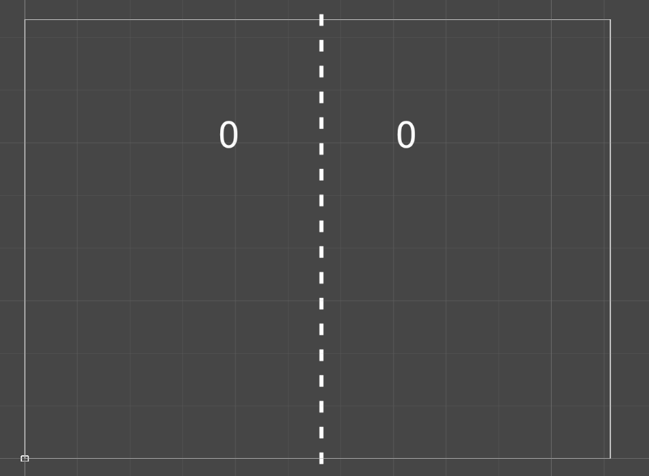

Adjust score as needed
I changed font to 100 and y size to 120

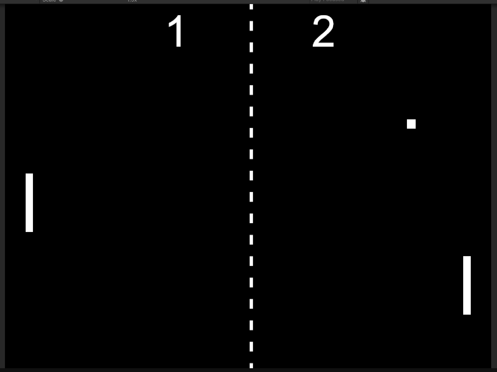

---
>Prev: [Prefabs](/06_Prefabs/PREFABS.md)