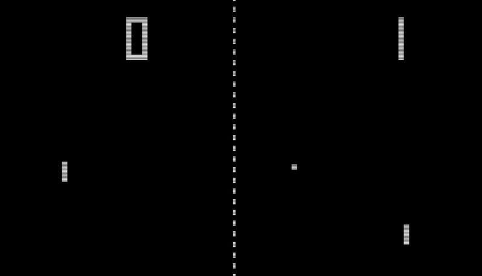

# Video Game Prototyping With Unity - _Pong_ Part 2

We're continuing to start our remake of _Pong_ inside Unity 6.

>[!TIP]
> Play [this version of _Pong_](https://www.primarygames.com/arcade/classic/pongclassic/) to get an idea of what the game play is like.

### Contents
***
* [Collision and Physics](/01_Collide/COLLIDE.md)
* [Player Input](/02_Input/INPUT.md)
* [Launching The Ball](/03_Launch/LAUNCH.md)
* [AI - Kind Of](/04_AI/AI.md)
* [GameManager](/05_Manager/MANAGER.md)
* [Prefabs](/06_Prefabs/PREFABS.md)
* [User Interface](/07_UI/UI.md)

---
>Next: [Collision and Physics](/01_Collide/COLLIDE.md)
